# Panduan Belajar Backend untuk Sidang

Project ini adalah backend Laravel untuk Sistem Informasi Pemancingan. Cara paling mudah memahami backend adalah membaca alur request:

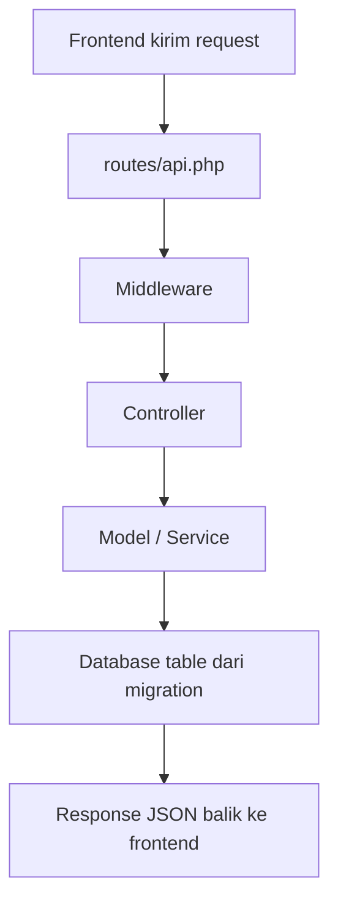

Kalimat sidang:

> Saat user melakukan aksi di frontend, frontend mengirim request ke endpoint API Laravel. Request tersebut masuk ke `routes/api.php`, dicek oleh middleware seperti autentikasi dan role, lalu diarahkan ke controller. Controller melakukan validasi, menjalankan logika bisnis melalui model atau service, menyimpan atau mengambil data sesuai struktur migration, kemudian mengembalikan response JSON ke frontend.

## 1. Routemap Urutan Belajar Backend

Belajarnya jangan langsung semua file. Ikuti urutan ini:

1. Pahami fungsi backend dalam sistem.
2. Pahami route API di `backend/routes/api.php`.
3. Pahami middleware: penjaga request sebelum masuk controller.
4. Pahami controller: tempat logika fitur dijalankan.
5. Pahami model: representasi tabel dan relasi data.
6. Pahami migration: rancangan struktur tabel.
7. Pahami service: helper logika khusus seperti QR dan notifikasi.
8. Pahami flow utama: register, approve member, check-in, pending order, checkout.
9. Pahami response JSON: data yang dikirim balik ke frontend.
10. Pahami cara menjelaskan backend saat demo frontend.

Urutan visual:

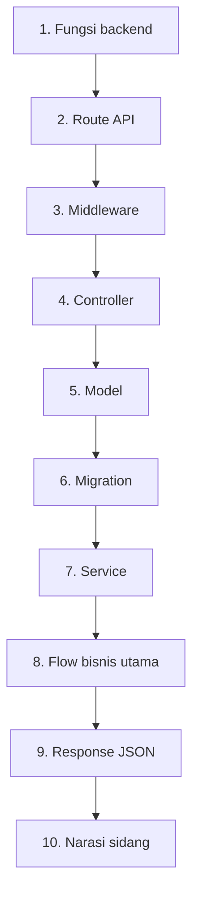

## 2. Middleware Itu Apa?

Middleware adalah lapisan pengecekan sebelum request sampai ke controller.

Analogi sederhananya:

- Route adalah alamat ruangan.
- Middleware adalah penjaga pintu.
- Controller adalah orang yang mengerjakan permintaan di dalam ruangan.

Contoh di project:

```php
Route::prefix('owner')->middleware(['auth:sanctum', 'role:owner'])->group(function () {
    Route::get('/pending-members', [MemberValidationController::class, 'getPendingMembers']);
});
```

Artinya:

1. Request masuk ke `/api/owner/pending-members`.
2. Middleware `auth:sanctum` mengecek user sudah login dan punya token.
3. Middleware `role:owner` mengecek role user adalah owner.
4. Kalau lolos, baru masuk ke `MemberValidationController@getPendingMembers`.
5. Kalau gagal, backend mengembalikan error `401` atau `403`.

File middleware role project ini:

`backend/app/Http/Middleware/CheckRole.php`

Fungsi pentingnya:

- Kalau user belum login, balikin `401 Unauthenticated`.
- Kalau role tidak sesuai, balikin `403 Unauthorized`.
- Kalau route untuk member, status member harus `active`.

Kalimat sidang:

> Middleware digunakan untuk membatasi akses API. Misalnya route owner hanya bisa diakses user yang sudah login dan memiliki role owner. Jika user member mencoba akses endpoint owner, request akan ditolak sebelum sampai ke controller.

## 3. Route Itu Apa?

Route adalah peta alamat API. Route menjawab pertanyaan:

- URL apa yang dipanggil frontend?
- Metode HTTP apa yang dipakai?
- Controller mana yang menjalankan fitur?
- Middleware apa yang melindungi route tersebut?

Contoh:

```php
Route::post('/login', [AuthController::class, 'login']);
```

Artinya:

- Method: `POST`
- URL: `/api/login`
- Controller: `AuthController`
- Function: `login`
- Middleware khusus: tidak ada, karena login memang harus bisa diakses sebelum user punya token.

Kalimat sidang:

> Route berfungsi sebagai penghubung antara endpoint API dengan controller. Ketika frontend mengirim request ke endpoint tertentu, Laravel mencocokkan URL dan HTTP method di route, lalu menjalankan method controller yang sesuai.

## 4. Controller Itu Apa?

Controller adalah tempat logika fitur dijalankan.

Controller biasanya melakukan:

1. Validasi input.
2. Cek kondisi bisnis.
3. Ambil atau ubah data lewat model.
4. Panggil service jika butuh proses khusus.
5. Kirim response JSON.

Contoh controller penting:

| Area | Controller | Fungsi |
|---|---|---|
| Auth | `AuthController` | register, login, logout, data user login |
| Owner | `MemberValidationController` | approve/reject/deactivate member |
| Employee | `ArrivalController` | check-in, search member, resolve QR |
| Employee | `PendingOrderController` | tambah dan ubah status pesanan |
| Employee | `TransactionController` | checkout transaksi |
| Member | `MemberController` | profile, voucher, riwayat, leaderboard |

Kalimat sidang:

> Controller menjadi pusat logika dari setiap fitur. Contohnya pada checkout, controller memvalidasi kedatangan pelanggan, menghitung total transaksi, menerapkan diskon tier dan voucher, mengurangi stok ikan, menambah poin member, lalu mengirim response transaksi ke frontend.

## 5. Migration Itu Apa?

Migration adalah file yang mendefinisikan struktur tabel database.

Yang dijelaskan bukan isi datanya, tapi rancangan tabelnya:

- nama tabel
- kolom
- tipe data
- foreign key
- index
- aturan relasi

Contoh:

`backend/database/migrations/2026_02_19_000003_create_transactions_table.php`

Tabel `transactions` berisi:

- `transaction_code`
- `arrival_id`
- `total_amount`
- `discount_tier`
- `discount_voucher`
- `final_amount`
- `payment_method`
- `points_earned`
- `processed_by`
- `transaction_date`

Kalimat sidang:

> Migration digunakan untuk membangun struktur database secara konsisten. Misalnya tabel transactions menyimpan ringkasan pembayaran, sedangkan transaction_items menyimpan detail item seperti ikan, menu, rental, dan penalti.

## 6. Model Itu Apa?

Model adalah representasi tabel dalam kode Laravel.

Contoh:

| Model | Tabel | Makna |
|---|---|---|
| `User` | `users` | akun login owner, pegawai, member |
| `Member` | `members` | profil member, poin, tier, QR |
| `Arrival` | `arrivals` | sesi kedatangan pelanggan |
| `PendingOrder` | `pending_orders` | pesanan sebelum dibayar |
| `Transaction` | `transactions` | transaksi checkout |
| `TransactionItem` | `transaction_items` | detail item transaksi |
| `FishStock` | `fish_stocks` | stok ikan |
| `Voucher` | `vouchers` | voucher member |

Kalimat sidang:

> Model digunakan agar controller dapat berinteraksi dengan tabel database melalui Eloquent ORM. Selain itu model juga menyimpan relasi, misalnya User memiliki satu Member, Arrival memiliki satu Transaction, dan Transaction memiliki banyak TransactionItem.

## 7. Cara Membaca Satu Route

Pakai rumus ini setiap membaca backend:

```text
METHOD + URL
-> Middleware apa?
-> Controller apa?
-> Function apa?
-> Input apa?
-> Tabel/model apa yang dipakai?
-> Output JSON apa?
-> Efeknya apa ke sistem?
```

Contoh format jawaban:

> Endpoint `POST /api/employee/check-in` digunakan oleh pegawai untuk mencatat kedatangan pelanggan. Route ini dilindungi middleware `auth:sanctum` dan `role:employee`, sehingga hanya pegawai login yang bisa mengakses. Request kemudian diarahkan ke `ArrivalController@checkIn`. Controller memvalidasi apakah tipe kedatangan member atau guest, lalu membuat data baru pada tabel `arrivals`. Setelah berhasil, backend mengembalikan response JSON berisi data kedatangan.

## 8. Flow Backend 1: Register dan Approve Member

Flow ini menjelaskan kenapa member tidak langsung aktif.

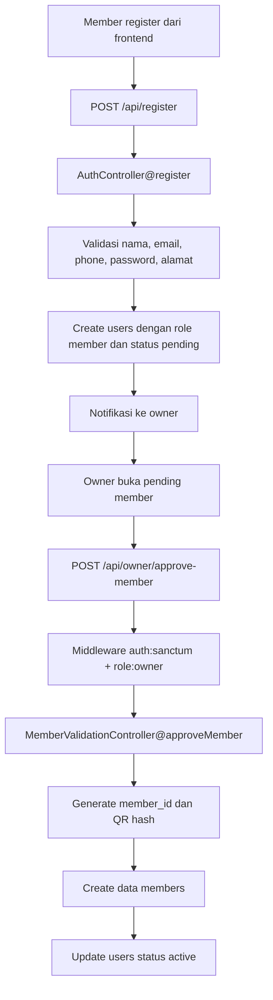

File yang dibaca:

- `backend/routes/api.php`
- `backend/app/Http/Controllers/Api/AuthController.php`
- `backend/app/Http/Controllers/Api/Owner/MemberValidationController.php`
- `backend/app/Services/QRCodeService.php`
- `backend/database/migrations/0001_01_01_000000_create_users_table.php`
- `backend/database/migrations/2026_02_14_190539_create_members_table.php`

Cara jelasin saat demo:

> Saat user mendaftar, backend tidak langsung menjadikan akun aktif. Data akun masuk ke tabel users dengan status pending. Owner kemudian melakukan approval melalui endpoint owner. Setelah disetujui, backend membuat data member, membuat member_id, membuat QR code, lalu mengubah status user menjadi active.

## 9. Flow Backend 2: Login dan Role Access

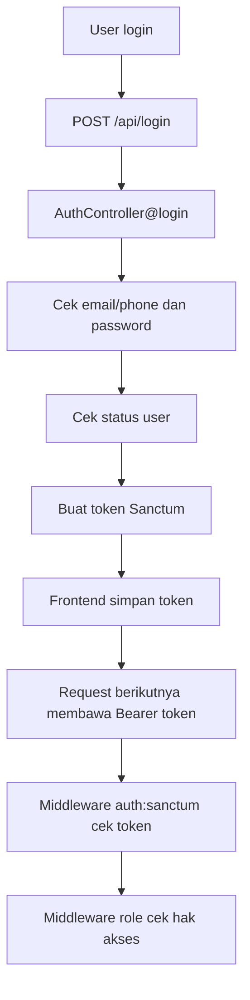

Cara jelasin:

> Login menggunakan Laravel Sanctum. Setelah email atau nomor telepon dan password valid, backend membuat token. Token ini dipakai frontend pada request berikutnya. Untuk endpoint yang dilindungi, backend mengecek token melalui `auth:sanctum` dan mengecek role melalui middleware `role`.

## 10. Flow Backend 3: Check-in Member atau Tamu

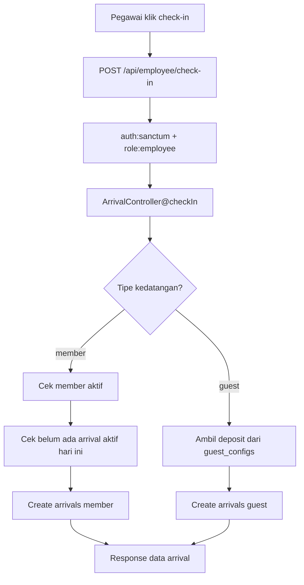

Tabel yang terkait:

- `members`
- `users`
- `arrivals`
- `guest_configs`

Cara jelasin:

> Check-in masuk ke endpoint employee sehingga hanya pegawai yang bisa mengakses. Controller membedakan tipe pelanggan, apakah member atau tamu. Untuk member, backend memastikan akun aktif dan belum memiliki arrival aktif hari ini. Untuk tamu, backend mengambil nominal deposit dari konfigurasi guest. Setelah itu data kedatangan disimpan ke tabel arrivals.

## 11. Flow Backend 4: Pending Order

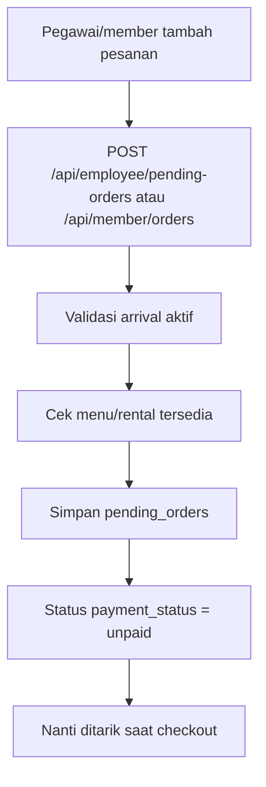

Cara jelasin:

> Pending order dipakai untuk menyimpan pesanan menu atau rental sebelum pelanggan membayar. Data ini belum masuk transaksi utama. Saat checkout, pending order dengan status unpaid akan diambil dan dimasukkan sebagai transaction item.

## 12. Flow Backend 5: Checkout Transaksi

Ini flow paling penting untuk sidang.

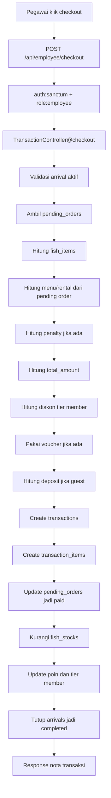

Tabel utama:

- `arrivals`
- `pending_orders`
- `transactions`
- `transaction_items`
- `fish_types`
- `fish_stocks`
- `members`
- `member_tiers`
- `vouchers`

Cara jelasin:

> Checkout adalah proses utama backend. Controller memastikan arrival masih aktif, mengambil pending order, menghitung item ikan, menu, rental, dan penalti. Jika pelanggan adalah member, backend menghitung diskon tier dan voucher. Jika pelanggan adalah tamu, backend menghitung deposit. Setelah transaksi disimpan, backend membuat detail item transaksi, menandai pending order sebagai paid, mengurangi stok ikan, menambah poin member, mengevaluasi tier, dan menutup arrival.

## 13. Cara Menjelaskan Backend Saat Menunjukkan Frontend

Saat sidang kamu jangan jelaskan semua kode. Pakai pola ini:

```text
Saat saya klik tombol ini di frontend,
frontend memanggil endpoint ...
endpoint tersebut ada di routes/api.php,
dilindungi middleware ...
lalu masuk ke controller ...
controller memvalidasi input ...
kemudian menggunakan model ...
data disimpan/diambil dari tabel ...
hasilnya dikirim kembali dalam bentuk JSON.
```

Contoh untuk tombol checkout:

> Ketika pegawai menekan tombol checkout, frontend mengirim request `POST /api/employee/checkout`. Endpoint ini berada di group employee, sehingga dilindungi `auth:sanctum` dan `role:employee`. Setelah lolos middleware, request masuk ke `TransactionController@checkout`. Di dalam controller, sistem memvalidasi arrival, menghitung transaksi, menerapkan diskon dan voucher, menyimpan data ke tabel transactions dan transaction_items, mengurangi fish_stocks, menambah poin member, lalu mengembalikan response JSON berisi nota transaksi.

## 14. File yang Harus Dipahami Dulu

Prioritas utama:

1. `backend/routes/api.php`
2. `backend/app/Http/Middleware/CheckRole.php`
3. `backend/app/Http/Controllers/Api/AuthController.php`
4. `backend/app/Http/Controllers/Api/Owner/MemberValidationController.php`
5. `backend/app/Http/Controllers/Api/Employee/ArrivalController.php`
6. `backend/app/Http/Controllers/Api/Employee/PendingOrderController.php`
7. `backend/app/Http/Controllers/Api/Employee/TransactionController.php`
8. `backend/app/Models/User.php`
9. `backend/app/Models/Member.php`
10. `backend/app/Models/Arrival.php`
11. `backend/app/Models/Transaction.php`

Migration prioritas:

1. `0001_01_01_000000_create_users_table.php`
2. `2026_02_10_113800_create_member_tiers_table.php`
3. `2026_02_14_190539_create_members_table.php`
4. `2026_02_19_000002_create_arrivals_table.php`
5. `2026_02_21_000001_create_pending_orders_table.php`
6. `2026_02_19_000003_create_transactions_table.php`
7. `2026_02_19_000004_create_transaction_items_table.php`
8. `2026_02_10_113802_create_fish_stocks_table.php`
9. `2026_02_27_000003_create_vouchers_table.php`

## 15. Checklist Pemahaman

Kamu dianggap paham backend kalau bisa menjawab ini:

- Apa fungsi `routes/api.php`?
- Apa beda route public dan protected?
- Apa itu middleware `auth:sanctum`?
- Apa itu middleware `role:owner`, `role:employee`, `role:member`?
- Kenapa member baru statusnya pending?
- Setelah owner approve, tabel apa yang berubah?
- Apa beda `users` dan `members`?
- Apa fungsi tabel `arrivals`?
- Kenapa pending order belum langsung masuk transaksi?
- Apa yang terjadi saat checkout?
- Tabel apa saja yang berubah setelah checkout?
- Kenapa stok ikan bisa berkurang otomatis?
- Dari mana poin member bertambah?
- Bagaimana backend mengirim hasil ke frontend?

## 16. Jawaban Super Singkat Kalau Blank Saat Sidang

Kalau kamu tiba-tiba blank, pakai kalimat ini:

> Alur backend pada sistem ini dimulai dari route API. Setiap request dari frontend masuk ke `routes/api.php`, kemudian dicek middleware autentikasi dan role. Setelah itu request diarahkan ke controller sesuai fitur. Controller melakukan validasi dan logika bisnis menggunakan model Eloquent. Struktur tabelnya didefinisikan pada migration. Setelah proses selesai, backend mengirim response JSON kembali ke frontend.

## 17. Cara Baca Route Laravel dari Nol

Ambil contoh route ini:

```php
Route::prefix('employee')->middleware(['auth:sanctum', 'role:employee'])->group(function () {
    Route::post('/check-in', [ArrivalController::class, 'checkIn']);
});
```

Cara bacanya pelan-pelan:

1. `Route::prefix('employee')`
   berarti semua route di dalam group diawali `/employee`.

2. File ini ada di `routes/api.php`, jadi endpoint API punya awalan `/api`.

3. `Route::post('/check-in', ...)`
   berarti endpoint lengkapnya:

   ```text
   POST /api/employee/check-in
   ```

4. `middleware(['auth:sanctum', 'role:employee'])`
   berarti request harus lolos dua penjaga:

   - `auth:sanctum`: user harus login dan punya token.
   - `role:employee`: user harus punya role employee.

5. `[ArrivalController::class, 'checkIn']`
   berarti kalau lolos middleware, Laravel menjalankan:

   ```text
   ArrivalController -> method checkIn()
   ```

Cara ucap saat sidang:

> Endpoint `POST /api/employee/check-in` berada di route group employee. Karena route group ini memakai middleware `auth:sanctum` dan `role:employee`, maka hanya pegawai yang sudah login yang bisa mengakses. Setelah lolos pengecekan, request diarahkan ke `ArrivalController` method `checkIn`.

## 18. Arti GET, POST, PUT, PATCH, DELETE

HTTP method itu memberi tahu tujuan request.

| Method | Cara pikir gampang | Biasanya untuk | Contoh di project |
|---|---|---|---|
| `GET` | ambil data | melihat/list/detail data | `GET /api/events`, `GET /api/employee/today-arrivals` |
| `POST` | kirim data baru atau proses aksi | login, register, create, checkout | `POST /api/login`, `POST /api/employee/checkout` |
| `PUT` | update data secara penuh | ubah profil/config/data master | `PUT /api/user/profile`, `PUT /api/owner/guest-config` |
| `PATCH` | update sebagian/status kecil | toggle, ubah status, mark read | `PATCH /api/employee/pending-orders/{id}/status` |
| `DELETE` | hapus/nonaktifkan | hapus data atau deactivate | `DELETE /api/owner/menus/{id}` |

Catatan penting:

- `GET` jangan dipakai untuk mengubah data.
- `POST` sering dipakai untuk proses besar, bukan cuma create. Contoh checkout.
- `PUT` biasanya update banyak field.
- `PATCH` biasanya update sebagian field, misalnya status.
- `DELETE` bisa benar-benar hapus, atau dalam beberapa sistem dipakai untuk menonaktifkan.

Contoh project:

```php
Route::get('/pending-members', [MemberValidationController::class, 'getPendingMembers']);
Route::post('/approve-member', [MemberValidationController::class, 'approveMember']);
Route::put('/guest-config', [OwnerGuestConfigController::class, 'update']);
Route::patch('/menus/{id}/availability', [OwnerMenuController::class, 'updateAvailability']);
Route::delete('/deactivate-member', [MemberValidationController::class, 'deactivateMember']);
```

Cara bacanya:

- `GET /pending-members`: owner mengambil daftar member pending.
- `POST /approve-member`: owner mengirim aksi approve member.
- `PUT /guest-config`: owner mengubah konfigurasi deposit tamu.
- `PATCH /menus/{id}/availability`: owner mengubah status ketersediaan satu menu.
- `DELETE /deactivate-member`: owner menonaktifkan member.

## 19. Arti Tanda dan Pola yang Sering Muncul

### `::class`

Contoh:

```php
AuthController::class
```

Artinya Laravel mengambil alamat class `AuthController`.

### `[Controller::class, 'method']`

Contoh:

```php
[AuthController::class, 'login']
```

Artinya request diarahkan ke method:

```text
AuthController@login
```

### `{id}`

Contoh:

```php
Route::patch('/menus/{id}/availability', ...)
```

`{id}` adalah parameter dari URL.

Jika frontend memanggil:

```text
PATCH /api/owner/menus/5/availability
```

maka nilai `id` adalah `5`.

Di controller biasanya diterima begini:

```php
public function updateAvailability(Request $request, int $id)
```

### `prefix`

`prefix` menambahkan awalan URL.

```php
Route::prefix('owner')->group(function () {
    Route::get('/menus', ...);
});
```

Endpoint lengkapnya:

```text
/api/owner/menus
```

### `group(function () { ... })`

Group berarti beberapa route memakai aturan yang sama, misalnya prefix dan middleware yang sama.

### `Request $request`

Ini objek yang berisi data dari frontend.

Contoh:

```php
$request->validate([
    'email' => 'required|email',
]);
```

Artinya backend mengecek input `email` wajib ada dan formatnya email.

### `response()->json(...)`

Ini response yang dikirim balik ke frontend dalam format JSON.

Contoh:

```php
return response()->json([
    'success' => true,
    'message' => 'Login berhasil',
]);
```

Frontend membaca response ini untuk menampilkan hasil ke user.

## 20. Folder `routes` Isinya Apa?

Di Laravel, folder `routes` berisi peta jalur masuk aplikasi.

### `routes/api.php`

Ini yang paling penting untuk project kamu.

Fungsi:

- Menyediakan endpoint JSON untuk frontend React.
- Dipakai oleh Axios dari frontend.
- Biasanya punya prefix `/api`.
- Banyak memakai token dan middleware role.

Contoh:

```text
/api/login
/api/member/profile
/api/employee/check-in
/api/owner/reports/summary
```

Kalimat sidang:

> `api.php` digunakan untuk mendefinisikan endpoint REST API yang dikonsumsi oleh frontend React. Route di file ini mengarah ke controller dan mayoritas mengembalikan response JSON.

### `routes/web.php`

Ini untuk route berbasis web/browser, bukan API JSON utama.

Di project kamu, `web.php` dipakai untuk menyajikan hasil build frontend dari folder:

```text
backend/html
```

Yang dilakukan:

- `/assets/...` melayani file JavaScript/CSS build frontend.
- `/images/...` melayani asset image.
- route fallback `/{path?}` mengirim `index.html`.
- route yang diawali `/api`, `/storage`, `/assets`, dan lain-lain dikecualikan dari fallback.

Kalimat sidang:

> `web.php` pada project ini digunakan untuk melayani file frontend SPA yang sudah dibuild, sedangkan komunikasi data tetap dilakukan melalui route API di `api.php`.

### `routes/console.php`

Ini untuk command terminal dan schedule otomatis.

Di project kamu:

```php
Schedule::command('vouchers:issue-monthly')->monthlyOn(1, '00:01');
Schedule::command('members:process-downgrade')->dailyAt('00:05');
```

Artinya:

- Setiap tanggal 1 jam 00:01, sistem menjalankan command pembagian voucher bulanan.
- Setiap hari jam 00:05, sistem menjalankan proses downgrade member.

Kalimat sidang:

> `console.php` digunakan untuk mendefinisikan command dan scheduler. Pada sistem ini scheduler dipakai untuk proses otomatis seperti penerbitan voucher bulanan dan evaluasi downgrade member.

## 21. Hubungan Route, Middleware, Controller, Model, Migration, Seeder

Hubungannya begini:

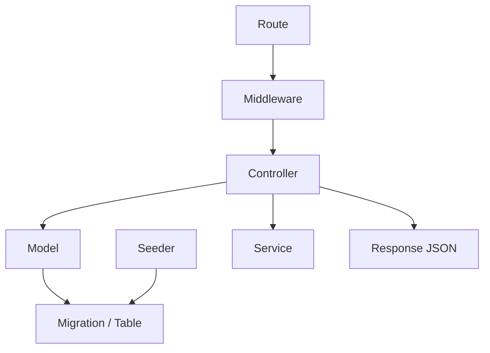

Penjelasan:

1. `Route`
   menentukan endpoint dan controller tujuan.

2. `Middleware`
   mengecek apakah request boleh lanjut.

3. `Controller`
   menjalankan logika fitur.

4. `Model`
   dipakai controller untuk akses data.

5. `Migration`
   mendefinisikan bentuk tabel yang dipakai model.

6. `Seeder`
   mengisi data awal atau data demo ke tabel.

7. `Service`
   menyimpan logika bantu yang dipakai controller.

8. `Response JSON`
   hasil akhir yang dikirim ke frontend.

Contoh nyata:

```text
POST /api/employee/checkout
-> middleware auth:sanctum + role:employee
-> TransactionController@checkout
-> model Arrival, PendingOrder, Transaction, TransactionItem, FishStock, Member, Voucher
-> tabel dari migration arrivals, pending_orders, transactions, transaction_items, fish_stocks, members, vouchers
-> response JSON nota transaksi
```

## 22. Seeder Itu Apa?

Seeder adalah file untuk mengisi data awal ke database.

Seeder dipakai untuk:

- data master
- akun demo
- data contoh untuk pengujian
- konfigurasi awal sistem

File pusatnya:

```text
backend/database/seeders/DatabaseSeeder.php
```

Di project kamu, `DatabaseSeeder` memanggil banyak seeder:

```php
$this->call([
    UserSeeder::class,
    GuestConfigSeeder::class,
    MemberTierSeeder::class,
    FishTypeSeeder::class,
    FishStockSeeder::class,
    EventSeeder::class,
    MenuSeeder::class,
    VoucherConfigSeeder::class,
    MemberSeeder::class,
    ArrivalSeeder::class,
    TransactionSeeder::class,
    TransactionItemSeeder::class,
    VoucherSeeder::class,
    NotificationSeeder::class,
    RentalItemSeeder::class,
]);
```

Cara bacanya:

- `UserSeeder` membuat akun owner, employee, member.
- `MemberTierSeeder` membuat tier REGULAR, BRONZE, SILVER, GOLD.
- `FishTypeSeeder` membuat jenis ikan seperti Patin, Nila, Gurame.
- `FishStockSeeder` membuat stok awal ikan.
- `MenuSeeder` membuat menu makanan/minuman.
- `VoucherConfigSeeder` membuat nominal voucher berdasarkan ranking.
- `MemberSeeder` membuat data profil member.
- `ArrivalSeeder`, `TransactionSeeder`, `TransactionItemSeeder` membuat data contoh transaksi.

Kenapa urutannya penting?

Karena ada foreign key.

Contoh:

- `members` butuh `users` dan `member_tiers`.
- `fish_stocks` butuh `fish_types`.
- `transactions` butuh `arrivals`.
- `transaction_items` butuh `transactions`.

Jadi data induk harus dibuat lebih dulu.

Kalimat sidang:

> Seeder digunakan untuk mengisi data awal dan data pengujian. Misalnya sistem membutuhkan akun owner dan pegawai, tier member, jenis ikan, stok ikan, menu, serta konfigurasi voucher. Data ini membantu proses demo dan pengujian tanpa harus menginput semuanya secara manual.

## 23. Migration vs Seeder

Ini sering bikin bingung.

| Bagian | Fungsi | Contoh |
|---|---|---|
| Migration | Membuat struktur tabel | tabel `users` punya kolom `name`, `email`, `role`, `status` |
| Seeder | Mengisi data ke tabel | membuat user `owner@pemancingan.com` |

Kalimat gampang:

> Migration membuat wadahnya, seeder mengisi isinya.

## 24. Cara Baca Controller dari Nol

Ambil contoh potongan pola controller:

```php
public function login(Request $request)
{
    $validator = Validator::make($request->all(), [
        'login' => 'required|string',
        'password' => 'required|string',
    ]);

    if ($validator->fails()) {
        return response()->json([...], 422);
    }

    if (!Auth::attempt([...])) {
        return response()->json([...], 401);
    }

    $user = Auth::user();
    $token = $user->createToken('auth-token')->plainTextToken;

    return response()->json([...], 200);
}
```

Cara bacanya:

1. `public function login(Request $request)`
   berarti method ini menerima request login dari frontend.

2. `Validator::make(...)`
   mengecek input wajib ada.

3. `if ($validator->fails())`
   kalau input salah, langsung balikin error.

4. `Auth::attempt(...)`
   mengecek email/phone dan password.

5. `$user = Auth::user()`
   mengambil user yang berhasil login.

6. `$user->createToken(...)`
   membuat token Sanctum.

7. `response()->json(...)`
   mengirim hasil login ke frontend.

Rumus baca controller:

```text
Input apa?
Validasi apa?
Data/model apa yang dicek?
Data/model apa yang dibuat atau diubah?
Kalau gagal response apa?
Kalau sukses response apa?
```

## 25. Cara Baca Migration dari Nol

Contoh:

```php
Schema::create('users', function (Blueprint $table) {
    $table->id();
    $table->string('name');
    $table->string('email')->unique();
    $table->enum('role', ['owner', 'employee', 'member'])->default('member');
    $table->enum('status', ['pending', 'active', 'rejected', 'deactivated'])->default('pending');
    $table->timestamps();
});
```

Cara bacanya:

1. `Schema::create('users', ...)`
   membuat tabel bernama `users`.

2. `$table->id()`
   membuat primary key `id`.

3. `$table->string('name')`
   membuat kolom teks pendek `name`.

4. `->unique()`
   nilainya tidak boleh kembar.

5. `$table->enum(...)`
   nilainya hanya boleh dari pilihan yang ditentukan.

6. `->default('member')`
   nilai bawaan jika tidak dikirim.

7. `$table->timestamps()`
   membuat kolom `created_at` dan `updated_at`.

Kalimat sidang:

> Migration mendefinisikan struktur tabel. Pada tabel users terdapat role untuk membedakan owner, employee, dan member, serta status untuk mengatur apakah akun pending, active, rejected, atau deactivated.

## 26. Cara Baca Model dari Nol

Contoh:

```php
class User extends Authenticatable
{
    protected $fillable = [
        'name',
        'phone',
        'email',
        'password',
        'address',
        'role',
        'status',
    ];

    public function member()
    {
        return $this->hasOne(Member::class);
    }
}
```

Cara bacanya:

1. `class User`
   berarti model untuk tabel `users`.

2. `$fillable`
   daftar kolom yang boleh diisi mass assignment.

3. `public function member()`
   relasi ke model `Member`.

4. `hasOne(Member::class)`
   satu user punya satu data member.

Kalimat sidang:

> Model User merepresentasikan akun pengguna. Di dalamnya terdapat relasi `hasOne` ke Member karena satu akun member memiliki satu profil member.

## 27. Peta Relasi Data Utama Project

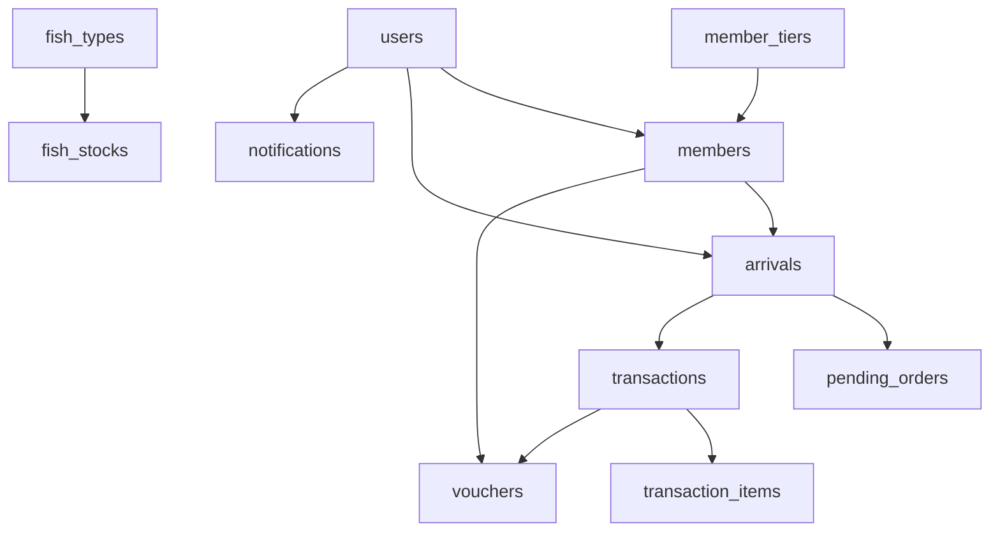

Cara bacanya:

- `users` menyimpan akun login.
- `members` menyimpan data khusus member.
- `member_tiers` menentukan level dan diskon member.
- `arrivals` menyimpan kunjungan/check-in.
- `pending_orders` menyimpan pesanan sebelum dibayar.
- `transactions` menyimpan transaksi checkout.
- `transaction_items` menyimpan detail item transaksi.
- `fish_types` menyimpan jenis ikan.
- `fish_stocks` menyimpan stok per jenis ikan.
- `vouchers` menyimpan voucher member.
- `notifications` menyimpan notifikasi user.

## 28. Contoh Cara Baca Lengkap: Pending Order Status

Route:

```php
Route::patch('/pending-orders/{id}/status', [PendingOrderController::class, 'updateStatus']);
```

Karena route ini ada di group:

```php
Route::prefix('employee')->middleware(['auth:sanctum', 'role:employee'])->group(...)
```

Endpoint lengkap:

```text
PATCH /api/employee/pending-orders/{id}/status
```

Cara baca:

1. `PATCH`
   berarti update sebagian data, dalam kasus ini status pesanan.

2. `/api/employee`
   berarti fitur pegawai.

3. `/pending-orders/{id}/status`
   berarti mengubah status pending order dengan id tertentu.

4. Middleware:
   harus login dan role employee.

5. Controller:
   `PendingOrderController@updateStatus`.

6. Input:
   `status`, dan kalau status `cancelled`, wajib ada `cancellation_reason`.

7. Model/tabel:
   `PendingOrder` atau tabel `pending_orders`.

8. Efek:
   kolom `production_status` berubah menjadi `pending`, `processing`, `done`, atau `cancelled`.

9. Response:
   JSON berisi status order terbaru.

Kalimat sidang:

> Endpoint ini menggunakan PATCH karena hanya mengubah sebagian data, yaitu status produksi pending order. Route-nya hanya bisa diakses pegawai karena berada di group employee dengan middleware auth dan role employee. Setelah request masuk, controller memvalidasi status yang dikirim, mencari pending order berdasarkan id, lalu memperbarui kolom production_status.

## 29. Contoh Cara Baca Lengkap: Owner Kelola Menu

Route:

```php
Route::get('/menus', [OwnerMenuController::class, 'index']);
Route::post('/menus', [OwnerMenuController::class, 'store']);
Route::put('/menus/{id}', [OwnerMenuController::class, 'update']);
Route::delete('/menus/{id}', [OwnerMenuController::class, 'destroy']);
Route::patch('/menus/{id}/availability', [OwnerMenuController::class, 'updateAvailability']);
Route::patch('/menus/{id}/toggle-special', [OwnerMenuController::class, 'toggleSpecial']);
```

Karena ada di group owner, semua endpoint lengkapnya diawali:

```text
/api/owner
```

Cara baca CRUD:

- `GET /api/owner/menus`
  mengambil daftar menu.

- `POST /api/owner/menus`
  membuat menu baru.

- `PUT /api/owner/menus/{id}`
  mengubah data menu.

- `DELETE /api/owner/menus/{id}`
  menghapus menu.

- `PATCH /api/owner/menus/{id}/availability`
  mengubah status tersedia/tidak tersedia.

- `PATCH /api/owner/menus/{id}/toggle-special`
  mengubah status menu spesial.

Kalimat sidang:

> Untuk fitur manajemen menu, backend menyediakan beberapa endpoint sesuai operasi. GET untuk mengambil daftar menu, POST untuk menambah, PUT untuk mengubah data utama, DELETE untuk menghapus, dan PATCH untuk perubahan kecil seperti status ketersediaan atau menu spesial.

## 30. Peta Folder Backend Project Ini

Kalau buka folder `backend`, cara bacanya seperti ini:

| Folder/File | Fungsi |
|---|---|
| `routes/` | peta URL masuk ke aplikasi |
| `app/Http/Controllers/Api/` | controller API yang menjalankan fitur |
| `app/Http/Middleware/` | pengecekan request sebelum masuk controller |
| `app/Models/` | representasi tabel database dan relasi |
| `database/migrations/` | struktur tabel database |
| `database/seeders/` | data awal atau data demo |
| `app/Services/` | logika bantu yang dipakai controller |
| `app/Console/Commands/` | perintah artisan custom |
| `config/` | konfigurasi aplikasi Laravel |
| `bootstrap/app.php` | pendaftaran route, middleware, dan exception handler |
| `public/` | file publik seperti `index.php`, Swagger, OpenAPI |
| `storage/` | file hasil upload, log, cache, QR, payment proof |

Kalimat sidang:

> Struktur backend mengikuti pola Laravel. Route mendefinisikan endpoint, controller menjalankan logika, model menghubungkan kode dengan database, migration mendefinisikan tabel, seeder mengisi data awal, service memisahkan logika khusus, dan config mengatur koneksi serta perilaku aplikasi.

## 31. Config Itu Apa?

Folder `config` berisi pengaturan Laravel. File config biasanya membaca nilai dari `.env`.

Contoh:

```php
'default' => env('DB_CONNECTION', 'sqlite')
```

Artinya:

- Laravel membaca `DB_CONNECTION` dari file `.env`.
- Kalau tidak ada, default-nya `sqlite`.

Pada project skripsi, README menjelaskan database yang digunakan adalah MySQL. Jadi saat dijalankan, `.env` biasanya berisi:

```text
DB_CONNECTION=mysql
DB_HOST=127.0.0.1
DB_DATABASE=pemancingan_sutoyo
DB_USERNAME=root
DB_PASSWORD=...
```

Kalimat sidang:

> Konfigurasi Laravel dipisahkan ke folder config dan file `.env`. Dengan begitu konfigurasi seperti koneksi database, mail, queue, dan session dapat diubah tanpa mengubah source code.

## 32. File Config Penting di Project Ini

| File config | Fungsi |
|---|---|
| `config/app.php` | nama aplikasi, environment, timezone, maintenance mode |
| `config/database.php` | koneksi database seperti MySQL, SQLite, PostgreSQL |
| `config/auth.php` | konfigurasi autentikasi user Laravel |
| `config/sanctum.php` | konfigurasi token/API auth Laravel Sanctum |
| `config/filesystems.php` | disk penyimpanan file seperti local/public/S3 |
| `config/mail.php` | konfigurasi email/reset password |
| `config/queue.php` | konfigurasi job queue |
| `config/cache.php` | konfigurasi cache |
| `config/session.php` | konfigurasi session browser |
| `config/services.php` | konfigurasi layanan eksternal |
| `config/logging.php` | konfigurasi log |
| `config/debugbar.php` | konfigurasi Laravel Debugbar saat development |

Yang paling sering kamu jelaskan saat sidang:

1. `database.php`
   untuk koneksi database MySQL.

2. `auth.php` dan `sanctum.php`
   untuk autentikasi user dan token API.

3. `filesystems.php`
   untuk upload file seperti QR code, gambar menu/event, dan payment proof.

4. `queue.php` dan `console.php`
   untuk proses otomatis seperti voucher bulanan dan downgrade member.

## 33. `bootstrap/app.php` Itu Apa?

File ini adalah konfigurasi awal aplikasi Laravel.

Di project ini bagian pentingnya:

```php
->withRouting(
    web: __DIR__.'/../routes/web.php',
    api: __DIR__.'/../routes/api.php',
    commands: __DIR__.'/../routes/console.php',
    health: '/up',
)
```

Artinya Laravel mendaftarkan:

- route web dari `routes/web.php`
- route API dari `routes/api.php`
- command/scheduler dari `routes/console.php`
- health check di `/up`

Bagian middleware:

```php
$middleware->alias([
    'role' => \App\Http\Middleware\CheckRole::class,
]);
```

Artinya middleware `CheckRole` diberi nama alias `role`, sehingga bisa dipakai seperti:

```php
->middleware('role:owner')
```

Kalimat sidang:

> `bootstrap/app.php` digunakan untuk mendaftarkan route utama dan middleware aplikasi. Pada project ini middleware `CheckRole` didaftarkan dengan alias `role`, sehingga route dapat membatasi akses berdasarkan role user.

## 34. Peta Database dari Migration

Ini bukan isi database, tapi struktur tabel yang dibuat oleh migration.

| Tabel | Migration | Fungsi |
|---|---|---|
| `users` | `0001_01_01_000000_create_users_table.php` | akun login owner, employee, member |
| `password_reset_tokens` | Laravel default | token reset password |
| `sessions` | Laravel default | data session browser |
| `cache`, `cache_locks` | Laravel default | cache aplikasi |
| `jobs`, `job_batches`, `failed_jobs` | Laravel default | queue/job background |
| `personal_access_tokens` | Sanctum | token API login |
| `member_tiers` | `create_member_tiers_table` | level member dan diskon |
| `members` | `create_members_table` | data profil member, QR, poin, berat ikan |
| `fish_types` | `create_fish_types_table` | jenis ikan dan harga per kg |
| `fish_stocks` | `create_fish_stocks_table` | stok ikan per jenis |
| `restock_logs` | `create_restock_logs_table` | riwayat restock ikan |
| `menus` | `create_menus_table` | menu makanan/minuman |
| `rental_items` | `create_rental_items_table` | alat rental |
| `events` | `create_events_table` | event dan informasi |
| `arrivals` | `create_arrivals_table` | sesi kedatangan/check-in |
| `pending_orders` | `create_pending_orders_table` | pesanan menu/rental sebelum dibayar |
| `transactions` | `create_transactions_table` | transaksi pembayaran |
| `transaction_items` | `create_transaction_items_table` | detail item transaksi |
| `voucher_configs` | `create_voucher_configs_table` | nominal voucher berdasarkan rank |
| `vouchers` | `create_vouchers_table` | voucher yang diterima member |
| `notifications` | `create_notifications_table` | notifikasi user |
| `guest_configs` | `create_guest_configs_table` | konfigurasi deposit tamu |
| `qris_configs` | `create_qris_configs_table` | gambar QRIS pembayaran |

Kalimat sidang:

> Database dirancang berdasarkan kebutuhan proses bisnis. Tabel users menyimpan akun, members menyimpan profil member, arrivals mencatat kunjungan, pending_orders menyimpan pesanan sementara, transactions dan transaction_items menyimpan hasil checkout, sedangkan fish_stocks dan vouchers ikut diperbarui oleh proses transaksi.

## 35. Peta Controller API

Controller API project ini terbagi berdasarkan role dan fitur.

### Controller umum/public

| Controller | Fungsi |
|---|---|
| `AuthController` | register, login, logout, me, reset password |
| `UserController` | update profil dan password user login |
| `EventController` | event/informasi publik |
| `FishTypeController` | jenis ikan publik |
| `MemberTierController` | tier member |
| `MenuController` | menu tersedia dan menu spesial publik/protected |
| `NotificationController` | list dan baca notifikasi |

### Controller member

| Controller | Fungsi |
|---|---|
| `Member/MemberController` | profile member, riwayat transaksi, leaderboard, voucher |
| `Member/OrderController` | member membuat dan melihat pesanan menu |

### Controller employee

| Controller | Fungsi |
|---|---|
| `Employee/ArrivalController` | check-in, check-out, search member/arrival, resolve QR |
| `Employee/PendingOrderController` | tambah pesanan, list pending order, ubah status produksi |
| `Employee/TransactionController` | checkout, riwayat transaksi, detail transaksi, voucher member |
| `Employee/MenuController` | list menu pegawai, ubah availability |
| `Employee/FishStockController` | lihat stok ikan |
| `Employee/RentalItemController` | lihat/toggle alat rental |
| `Employee/GuestConfigController` | lihat deposit tamu |
| `Employee/QrisConfigController` | lihat QRIS |

### Controller owner

| Controller | Fungsi |
|---|---|
| `Owner/MemberValidationController` | pending member, approve, reject, deactivate, reactivation, history |
| `Owner/EmployeeController` | kelola akun pegawai |
| `Owner/MenuController` | kelola menu |
| `Owner/FishTypeController` | kelola jenis ikan |
| `Owner/FishStockController` | lihat stok, restock, threshold, histori |
| `Owner/RentalItemController` | kelola rental item |
| `Owner/EventController` | kelola event dan informasi |
| `Owner/ReportController` | laporan keuangan, breakdown, export, trend, stock summary |
| `Owner/LeaderboardController` | leaderboard owner |
| `Owner/VoucherController` | list voucher |
| `Owner/VoucherConfigController` | konfigurasi nominal voucher |
| `Owner/GuestConfigController` | konfigurasi deposit tamu |
| `Owner/QrisConfigController` | konfigurasi QRIS |

Kalimat sidang:

> Controller dipisahkan berdasarkan role agar struktur backend lebih mudah dipahami. Controller owner menangani pengelolaan dan laporan, controller employee menangani operasional harian, controller member menangani layanan pelanggan terdaftar, sedangkan controller umum menangani fitur publik dan autentikasi.

## 36. Peta Model

| Model | Makna |
|---|---|
| `User` | akun login semua role |
| `Member` | profil member, poin, QR, tier |
| `MemberTier` | aturan tier dan diskon |
| `Arrival` | sesi kedatangan pelanggan |
| `PendingOrder` | pesanan sementara sebelum checkout |
| `Transaction` | transaksi pembayaran |
| `TransactionItem` | detail item transaksi |
| `FishType` | jenis ikan |
| `FishStock` | stok ikan |
| `RestockLog` | riwayat restock |
| `Menu` | menu makanan/minuman |
| `RentalItem` | alat rental |
| `Event` | event/info publik |
| `VoucherConfig` | konfigurasi nominal voucher |
| `Voucher` | voucher member |
| `Notification` | notifikasi |
| `GuestConfig` | konfigurasi deposit tamu |
| `QrisConfig` | konfigurasi gambar QRIS |

Kalimat sidang:

> Model dipakai sebagai representasi tabel di Laravel. Controller tidak menulis query SQL mentah untuk operasi umum, tetapi menggunakan model Eloquent agar relasi dan operasi database lebih terstruktur.

## 37. Peta Service

| Service | Fungsi |
|---|---|
| `QRCodeService` | membuat, mengambil URL, dan menghapus QR code member |
| `NotificationService` | membuat notifikasi untuk user atau role tertentu |

Contoh:

- Saat owner approve member, backend memakai `QRCodeService` untuk membuat QR member.
- Saat member baru register, backend memakai `NotificationService` untuk memberi notifikasi ke owner.
- Saat stok ikan melewati threshold, backend mengirim notifikasi low stock.

Kalimat sidang:

> Service digunakan untuk memisahkan logika khusus dari controller. Misalnya pembuatan QR code member diletakkan di `QRCodeService`, sedangkan pengiriman notifikasi diletakkan di `NotificationService`.

## 38. Peta Command dan Scheduler

Folder:

```text
backend/app/Console/Commands
```

Command yang ada:

| Command class | Fungsi |
|---|---|
| `IssueMonthlyVouchers` | menerbitkan voucher bulanan berdasarkan leaderboard |
| `ProcessMemberDowngrade` | memproses downgrade member |
| `RegenerateMemberQR` | membuat ulang QR member |

Scheduler ada di:

```text
backend/routes/console.php
```

Jadwal:

```php
Schedule::command('vouchers:issue-monthly')->monthlyOn(1, '00:01');
Schedule::command('members:process-downgrade')->dailyAt('00:05');
```

Kalimat sidang:

> Selain API yang dipanggil frontend, backend juga memiliki proses otomatis melalui scheduler. Contohnya penerbitan voucher bulanan dan evaluasi downgrade member dijalankan otomatis melalui command artisan.

## 39. Cara Menjawab Kalau Ditanya "Backend Ini Pakai Apa Saja?"

Jawaban ringkas:

> Backend dibangun menggunakan Laravel 12 dengan REST API. Autentikasi menggunakan Laravel Sanctum, database menggunakan MySQL, struktur database dibuat melalui migration, data awal melalui seeder, akses endpoint dibatasi middleware role, dan response dikirim dalam format JSON ke frontend React.

Jawaban agak lengkap:

> Struktur backend terdiri dari route API, middleware, controller, model, migration, seeder, service, dan scheduler. Route API mendefinisikan endpoint, middleware mengecek token dan role, controller menjalankan logika bisnis, model berinteraksi dengan database, migration mendefinisikan tabel, seeder mengisi data awal, service menangani QR code dan notifikasi, sedangkan scheduler menangani proses otomatis seperti voucher bulanan.

## 40. Urutan Belajar Seluruh Backend Project

Ikuti urutan ini agar tidak bingung:

1. Baca `backend/bootstrap/app.php`
   untuk tahu route dan middleware didaftarkan dari mana.

2. Baca `backend/routes/api.php`
   untuk tahu semua endpoint.

3. Baca `backend/routes/web.php`
   untuk tahu frontend build dilayani dari backend.

4. Baca `backend/routes/console.php`
   untuk tahu scheduler otomatis.

5. Baca `backend/app/Http/Middleware/CheckRole.php`
   untuk paham pembatasan role.

6. Baca `AuthController`
   untuk paham register, login, token.

7. Baca migration `users`, `members`, `member_tiers`
   untuk paham akun dan member.

8. Baca `MemberValidationController`
   untuk paham owner approve member.

9. Baca `ArrivalController`
   untuk paham check-in.

10. Baca migration `arrivals` dan `pending_orders`
    untuk paham kunjungan dan pesanan sementara.

11. Baca `PendingOrderController`
    untuk paham tambah pesanan.

12. Baca migration `transactions` dan `transaction_items`
    untuk paham struktur transaksi.

13. Baca `TransactionController`
    untuk paham checkout.

14. Baca model `User`, `Member`, `Arrival`, `Transaction`
    untuk paham relasi.

15. Baca `ReportController`
    untuk paham laporan owner.

16. Baca config penting:
    `database.php`, `auth.php`, `sanctum.php`, `filesystems.php`, `queue.php`.

17. Baca seeder:
    `DatabaseSeeder`, `UserSeeder`, `MemberTierSeeder`, `FishTypeSeeder`, `MenuSeeder`.

18. Baca service:
    `QRCodeService`, `NotificationService`.

19. Baca command:
    `IssueMonthlyVouchers`, `ProcessMemberDowngrade`.

20. Latihan jelaskan satu fitur dari frontend sampai backend.

## 41. Template Menjelaskan Semua Fitur Backend

Pakai template ini untuk fitur apa pun:

```text
Fitur:
Endpoint:
HTTP method:
File route:
Middleware:
Controller:
Method controller:
Input dari frontend:
Validasi:
Model yang dipakai:
Tabel yang terkait:
Efek ke database:
Response ke frontend:
```

Contoh singkat:

```text
Fitur: Check-in member
Endpoint: /api/employee/check-in
HTTP method: POST
File route: routes/api.php
Middleware: auth:sanctum, role:employee
Controller: Employee/ArrivalController
Method controller: checkIn
Input dari frontend: type, member_id, notes
Validasi: type wajib member/guest, member_id wajib jika member
Model yang dipakai: Arrival, Member, GuestConfig
Tabel yang terkait: arrivals, members, users, guest_configs
Efek ke database: membuat arrival baru dengan status active
Response ke frontend: data arrival hasil check-in
```

## 42. Cara Request Masuk ke Laravel dari Awal

Urutan paling awal backend Laravel:

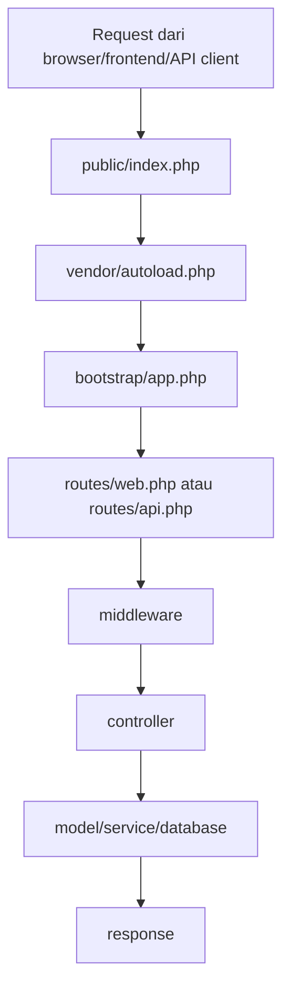

Penjelasan:

1. `public/index.php`
   adalah pintu masuk utama Laravel.

2. `vendor/autoload.php`
   memuat dependency Composer.

3. `bootstrap/app.php`
   menyiapkan aplikasi Laravel, route, middleware, dan error handler.

4. Laravel memilih route:
   - `/api/...` masuk ke `routes/api.php`
   - halaman web masuk ke `routes/web.php`

5. Middleware mengecek request.

6. Controller menjalankan logika.

7. Model/service dipakai untuk data dan proses khusus.

8. Backend mengirim response.

Kalimat sidang:

> Semua request Laravel masuk melalui `public/index.php`. Setelah Laravel dibootstrap, request diarahkan ke route yang sesuai, melewati middleware, masuk ke controller, lalu controller menggunakan model atau service sebelum mengembalikan response.

## 43. Backend Top-Level Folder

Ini isi folder `backend` dan cara bacanya:

| Item | Jenis | Fungsi |
|---|---|---|
| `app/` | folder kode utama | berisi controller, model, middleware, service, command |
| `bootstrap/` | bootstrap Laravel | konfigurasi awal aplikasi dan cache bootstrap |
| `config/` | konfigurasi | database, auth, sanctum, mail, queue, filesystem |
| `database/` | database code | migration, seeder, factory |
| `html/` | frontend build | hasil build SPA/frontend yang dilayani backend |
| `public/` | document root | pintu masuk web, swagger, openapi, storage symlink |
| `resources/` | resource Laravel | view Blade, mail template, css/js Laravel |
| `routes/` | daftar route | api, web, console |
| `scripts/` | helper script | script generate OpenAPI |
| `storage/` | runtime storage | log, cache, upload file, QR code, payment proof |
| `tests/` | test | feature dan unit test |
| `vendor/` | dependency PHP | package dari Composer |
| `artisan` | CLI Laravel | menjalankan command seperti migrate, test, schedule |
| `composer.json` | dependency PHP | daftar package Laravel/PHP |
| `package.json` | dependency Node | asset build/Vite untuk Laravel |
| `phpunit.xml` | config test | konfigurasi PHPUnit |
| `.env` | environment | konfigurasi lokal seperti DB, app key, mail |

Kalimat sidang:

> Folder backend mengikuti struktur Laravel. Kode utama berada di app, route berada di routes, struktur database ada di database/migrations, konfigurasi di config, file publik di public, dan file runtime seperti log/upload berada di storage.

## 44. Folder `app` Dijelaskan Lengkap

Folder `app` adalah inti aplikasi.

| Folder | Fungsi |
|---|---|
| `app/Console/Commands` | command custom untuk artisan dan scheduler |
| `app/Exports` | class export Excel/laporan |
| `app/Http/Controllers` | controller request |
| `app/Http/Controllers/Api` | controller REST API |
| `app/Http/Middleware` | middleware pengecekan request |
| `app/Models` | model Eloquent/tabel |
| `app/Notifications` | notifikasi/email |
| `app/Providers` | service provider Laravel |
| `app/Services` | logika bantu khusus |
| `app/Traits` | potongan logic reusable |

### `app/Console/Commands`

Berisi command artisan custom.

Di project:

- `IssueMonthlyVouchers`
- `ProcessMemberDowngrade`
- `RegenerateMemberQR`

Dipakai untuk proses yang tidak langsung dari klik frontend, misalnya proses otomatis.

### `app/Exports`

Berisi logic export.

Di project:

- `TransactionReportExport`

Dipakai oleh `Owner/ReportController` untuk export laporan transaksi ke Excel.

### `app/Http/Controllers/Api`

Ini pusat controller API.

Dibagi menjadi:

- controller umum
- controller owner
- controller employee
- controller member

### `app/Http/Middleware`

Berisi `CheckRole.php`.

Dipakai untuk mengecek role:

- owner
- employee
- member

### `app/Models`

Berisi class model yang mewakili tabel.

Contoh:

- `User` mewakili `users`
- `Member` mewakili `members`
- `Transaction` mewakili `transactions`

### `app/Notifications`

Berisi notifikasi email.

Di project:

- `ResetPasswordNotification`

Dipakai saat user meminta reset password.

### `app/Providers`

Berisi service provider.

Di project:

- `AppServiceProvider`

Saat ini masih standar, tapi secara Laravel tempat ini bisa dipakai untuk mendaftarkan service global.

### `app/Services`

Berisi service:

- `QRCodeService`
- `NotificationService`

Dipakai untuk memisahkan logika QR dan notifikasi dari controller.

### `app/Traits`

Berisi logic reusable:

- `CalculatesDiscountTier`

Dipakai untuk membagi diskon tier per item saat export laporan.

Kalimat sidang:

> Folder app berisi kode utama aplikasi. Controller menangani request, middleware membatasi akses, model merepresentasikan tabel, service memisahkan logika khusus, command menangani proses otomatis, dan export/trait membantu fitur laporan.

## 45. Folder `bootstrap`

Isi penting:

| File/folder | Fungsi |
|---|---|
| `bootstrap/app.php` | konfigurasi awal aplikasi, route, middleware, exception |
| `bootstrap/providers.php` | daftar provider aplikasi |
| `bootstrap/cache/` | cache konfigurasi/package/service |

Yang perlu kamu paham:

- `app.php` mendaftarkan route `web.php`, `api.php`, dan `console.php`.
- `app.php` juga mendaftarkan alias middleware `role`.
- `cache/` adalah hasil cache Laravel, biasanya tidak dijelaskan detail saat sidang.

Kalimat sidang:

> Bootstrap adalah tahap inisialisasi Laravel. Pada project ini, file bootstrap/app.php menjadi tempat route dan middleware utama didaftarkan.

## 46. Folder `database`

Biasanya berisi:

| Folder | Fungsi |
|---|---|
| `migrations/` | struktur tabel |
| `seeders/` | data awal/data demo |
| `factories/` | pembuat data dummy untuk testing/seeding |

Di project ini:

- migrations mendefinisikan tabel sistem pemancingan.
- seeders mengisi akun demo, tier, ikan, menu, stok, voucher, dan data contoh.
- factory ada untuk kebutuhan test/default Laravel.

Kalimat sidang:

> Folder database berisi rancangan dan data awal. Migration mendefinisikan tabel, sedangkan seeder mengisi data awal agar sistem bisa langsung digunakan untuk demo atau pengujian.

## 47. Folder `html`

Folder `backend/html` berisi hasil build frontend SPA.

Di dalamnya ada:

- `index.html`
- `assets/`
- `images/`
- `vite.svg`

Hubungannya dengan `web.php`:

- `routes/web.php` membaca file dari `backend/html`.
- Jika user membuka halaman seperti `/owner/dashboard`, backend tetap mengembalikan `index.html`.
- Setelah itu React di frontend yang mengatur halaman.

Kalimat sidang:

> Folder html berisi hasil build frontend yang disajikan oleh backend Laravel. Backend melayani file statisnya melalui route web, sedangkan data tetap diambil melalui endpoint API.

## 48. Folder `public`

Folder `public` adalah document root web server.

Isi penting:

| File/folder | Fungsi |
|---|---|
| `index.php` | pintu masuk Laravel |
| `.htaccess` | konfigurasi rewrite Apache |
| `openapi.json` | dokumentasi API dalam format OpenAPI |
| `swagger.html` | halaman Swagger UI untuk membaca API |
| `storage/` | symlink ke storage publik |
| `robots.txt` | instruksi crawler |
| `favicon.ico` | icon website |

Kalimat sidang:

> Folder public adalah folder yang diakses langsung oleh web server. File index.php menjadi pintu masuk Laravel, sedangkan swagger.html dan openapi.json digunakan untuk dokumentasi API.

## 49. Folder `resources`

Folder `resources` berisi resource bawaan Laravel.

Di project ini ada:

- `resources/css`
- `resources/js`
- `resources/views`
- `resources/views/vendor/mail`
- `resources/views/vendor/notifications`

Fungsi penting:

- template email
- template notification
- asset Laravel bawaan
- view Blade jika dibutuhkan

Karena frontend utama project ini ada di React, folder ini bukan pusat UI utama, tapi tetap dipakai untuk hal seperti email reset password.

Kalimat sidang:

> Resources berisi template dan asset Laravel. Pada project ini UI utama berada di frontend React, sehingga resources lebih banyak berperan untuk template email atau view bawaan Laravel.

## 50. Folder `storage`

Folder `storage` adalah tempat file runtime.

Biasanya berisi:

| Folder | Fungsi |
|---|---|
| `storage/app` | file aplikasi |
| `storage/app/public` | file publik seperti QR/payment proof |
| `storage/framework` | cache, session, view compiled |
| `storage/logs` | log aplikasi |
| `storage/debugbar` | data debugbar saat development |

Di project ini, storage bisa terkait dengan:

- QR code member
- payment proof
- gambar upload
- log aplikasi
- cache Laravel

Kalimat sidang:

> Storage digunakan untuk menyimpan file runtime seperti upload, QR code, payment proof, cache, dan log. File yang perlu diakses publik biasanya disimpan di disk public dan dihubungkan melalui public/storage.

## 51. Folder `tests`

Folder `tests` berisi pengujian otomatis.

Di project ini ada:

- `Feature/EmployeeAccountManagementTest.php`
- `Feature/SpaFrontendTest.php`
- `Feature/ExampleTest.php`
- `Unit/ExampleTest.php`

Perbedaan:

- Feature test mengecek fitur dari sisi request/aplikasi.
- Unit test mengecek bagian kecil logic.

Kalimat sidang:

> Folder tests berisi pengujian otomatis. Feature test digunakan untuk menguji alur fitur, sedangkan unit test untuk menguji logic yang lebih kecil.

## 52. Folder `scripts`

Di project ini ada:

```text
scripts/generate_openapi.py
```

Fungsinya untuk membantu menghasilkan dokumentasi OpenAPI/Swagger dari route/controller.

Kalimat sidang:

> Folder scripts berisi helper pengembangan. Pada project ini script digunakan untuk membantu generate dokumentasi OpenAPI.

## 53. File Penting di Root Backend

| File | Fungsi |
|---|---|
| `artisan` | command line Laravel |
| `composer.json` | daftar dependency PHP dan script Laravel |
| `composer.lock` | versi pasti dependency PHP |
| `package.json` | dependency Node untuk Vite/build asset |
| `vite.config.js` | konfigurasi Vite Laravel |
| `phpunit.xml` | konfigurasi testing |
| `.env` | konfigurasi lokal rahasia |
| `.env.example` | contoh konfigurasi environment |
| `README.md` | dokumentasi bawaan Laravel/project |

Contoh command yang berhubungan:

```bash
php artisan migrate
php artisan db:seed
php artisan test
php artisan schedule:run
php artisan route:list
```

Kalimat sidang:

> File root seperti artisan dan composer.json digunakan untuk menjalankan dan mengelola backend Laravel. File `.env` menyimpan konfigurasi environment, sedangkan phpunit.xml digunakan untuk testing.

## 54. Cara Mengajar Diri Sendiri Membaca Satu Folder

Pakai pola ini:

```text
Folder ini berisi apa?
File mana yang paling penting?
File ini dipanggil dari mana?
File ini memanggil apa?
Efeknya ke fitur apa?
Kalau sidang, kalimat simpelnya apa?
```

Contoh `app/Http/Controllers/Api/Employee`:

```text
Folder ini berisi controller untuk role pegawai.
File pentingnya ArrivalController, PendingOrderController, TransactionController.
Route-nya ada di routes/api.php dalam prefix employee.
Controller ini memakai model Arrival, PendingOrder, Transaction, FishStock, Member.
Efeknya ke fitur check-in, pesanan, dan checkout.
Kalimat sidang: controller employee menangani operasional harian pemancingan.
```

## 55. Peta Besar Backend Project dalam Satu Gambar

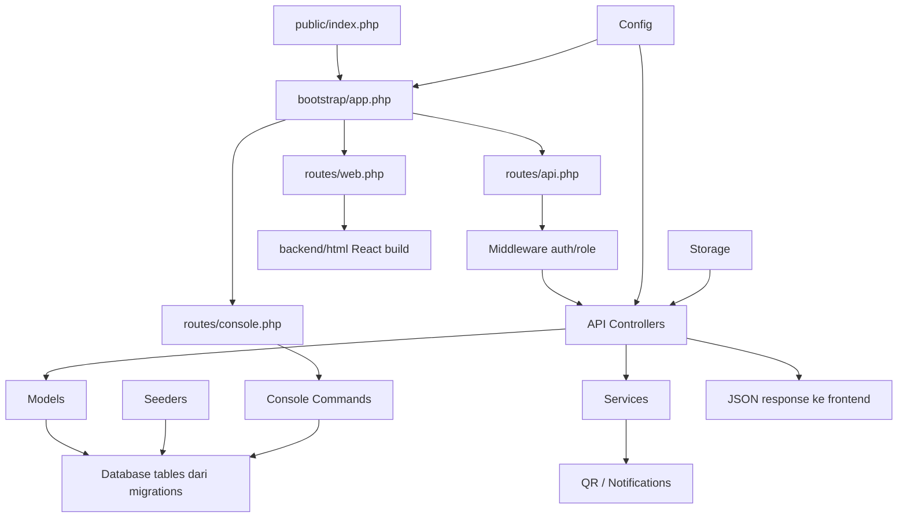

Kalimat sidang final:

> Secara keseluruhan, backend Laravel dimulai dari public/index.php, lalu aplikasi dibootstrap melalui bootstrap/app.php. Route API mengarahkan request ke controller setelah melewati middleware. Controller menjalankan logika bisnis dengan model, service, dan tabel database yang strukturnya dibuat melalui migration. Seeder menyediakan data awal, config mengatur environment, storage menyimpan file runtime, dan console command menjalankan proses otomatis.
